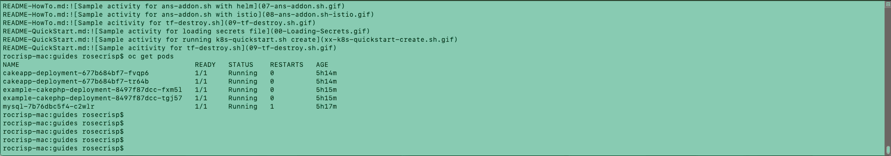

go-operator-demo
=======================

Need Knowledge of openshift, kubernetes, and go

Requirements:

Install [Golang](https://golang.org/doc/install)

Install [operator-sdk](https://sdk.operatorframework.io/docs/install-operator-sdk/)

Install [Openshift Container Platform 4.5](https://docs.openshift.com/container-platform/4.5/welcome/index.html)

Run Operator sdk locally
```bash
git clone https://github.com/rocrisp/go-operator-demo.git
cd go-operator-demo
OPERATOR_NAME=cakephp operator-sdk run --local
```


In another terminal
```bash
cd go-operator-demo
oc apply -f deploy/crds/cakephp.example.com_v1alpha1_cakephp_cr.yaml
```




